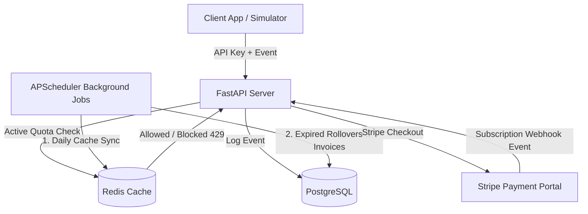

<h1 align="center">🔷 Usage Metering & Billing Engine</h1>

<p align="center">
  A high-performance production-grade backend infrastructure and dashboard for API usage metering and billing orchestration.<br/>
  Enables real-time client traffic logging, Redis-backed quota enforcement, and Stripe subscription lifecycle syncs.
</p>

<p align="center">
  
  
  
  
  
  
</p>

---

## 📌 Project Overview

This capstone project is a complete usage-based billing platform designed to track client request consumption and process billing operations. It records client requests dynamically, enforces usage limits, generates invoices, and integrates with **Stripe** subscriptions. 

The project includes:
1. **FastAPI Metering Engine**: Processes high-throughput log requests, verifies limits via Redis, and writes transactional records.
2. **APScheduler Background Service**: Periodic background scheduler performing daily Redis counter rebuilds and generating invoices for expired periods.
3. **React + Vite Dashboard**: High-aesthetic dark-mode glassmorphic client interface allowing users to simulate API traffic, check limits, and request Stripe plan upgrades.
4. **Stripe Integration & Local Sandbox Fallback**: Validated stripe checkout sessions and webhook updates, with a local sandbox mode for keyless billing simulation.

---

## ⚙️ Core Architecture Flow



---

## 📁 Project Structure

```
Capstone Project/
├── docker-compose.yml             # Relational Postgres and Cache Redis multi-container environment
├── README.md                      # Setup and deployment documentation
├── backend/                       # Python FastAPI backend core
│   ├── Dockerfile                 # Container build instructions
│   ├── requirements.txt           # Python application dependencies
│   ├── app/                       # FastAPI application module
│   │   ├── main.py                # Server lifecycle setup and CORS middleware configuration
│   │   ├── api/                   # Controller endpoints (auth, logging, reporting, stripe checkout)
│   │   ├── core/                  # Configurations, environment settings, and Redis connection client
│   │   ├── db/                    # Relational session configuration
│   │   ├── models/                # SQLAlchemy database models (Customer, Subscription, Plan, UsageEvent, Invoice)
│   │   ├── jobs/                  # Background scheduler tasks and daily cron logic
│   │   └── services/              # Billing costs formulas and calculation engines
│   └── tests/                     # 21-test Pytest suite (auth, quota, stripe webhook, invoices)
└── Usage and Billing Dashboard/   # React client frontend
    ├── package.json               # Node.js dependencies configuration
    ├── index.html                 # App container template
    ├── tsconfig.json              # TypeScript compilation rules
    └── src/
        ├── main.tsx               # App entrypoint script
        ├── App.tsx                # Dashboard layout, graph plotting, and api integrations
        └── index.css              # Custom Tailwind CSS v4 styling rules
```

---

## 🚀 Getting Started

### Prerequisites
- **Docker Desktop** running on your host machine.
- **Node.js** and **npm** installed locally.

---

### Step-by-Step Setup

#### 1. Configure the Backend Environment
Create the active `.env` file from the example configuration:
```bash
cp backend/.env.example backend/.env
```

#### 2. Start the Backend Infrastructure
Launch PostgreSQL, Redis, and the FastAPI application containers:
```bash
docker compose up --build -d
```

#### 3. Run Database Migrations and Seeding
Upgrade the database schema to the latest migration and seed default billing plans (`free` and `pro`):
```bash
# Run schema migration
docker compose exec api alembic upgrade head

# Seed default plans
docker compose exec api python -m app.seed
```

#### 4. Run the Backend Tests
Run the entire Pytest suite to confirm that authorization, rate limiting, stripe checkout, and background job rules pass:
```bash
docker compose exec api python -m pytest -v
```

#### 5. Launch the Frontend Dashboard
Navigate to the dashboard directory, install dependencies, and start the development server:
```bash
cd "Usage and Billing Dashboard"
npm install
npm run dev
```
Open your browser and navigate to the printed URL (usually **`http://localhost:8443`** or **`http://localhost:5173`**).

---

## 🧪 Testing the Metering & Billing Flow

### 1. Register & Connect
- On the dashboard login screen, click **"Generate Sandbox Test Profile"**.
- This registers a customer in the PostgreSQL database, issues a secret key (`sk_live_...`), and loads the Starter Plan metrics.

### 2. Simulate API Request Load
- Go to the **API Request Simulator** panel.
- Select a mock endpoint, set the units (e.g. `150`), and click **"Send Request Event"**.
- You will see the **Quota Meter** progress bar advance, the **Requests Used** counter increase, and the **Estimated Bill** recalculate in real-time.

### 3. Verify Quota Limit Block (HTTP 429)
- Send a request with `1000` or more units to exceed the Starter Plan limit.
- The simulator will display a warning:
  > 🔴 *Quota Exceeded! Metering engine returned HTTP 429 Rate Limit block.*

### 4. Test Stripe Upgrades (Sandbox Mode)
- Click **"Upgrade to Pro"** on the Pro Plan card.
- In sandbox mode (using `STRIPE_API_KEY=sk_test_placeholder`), this bypasses external Stripe server calls, automatically updates the plan to `pro` in the database, and reloads your dashboard instantly with a upgraded **50,000 monthly quota limit**.
- Click **"Switch to Starter"** to downgrade back to Starter and test limit restoration.

---

## 🔌 Stripe Webhook Testing (Stripe CLI)

If you configure a real Stripe Test Key in `backend/.env` and want to test webhook callbacks locally:

1. **Install Stripe CLI** and login to your developer account:
   ```bash
   stripe login
   ```
2. **Forward webhook events** to your local running API service container:
   ```bash
   stripe listen --forward-to localhost:8000/v1/webhooks/stripe
   ```
3. Copy the webhook secret printed in the console (starts with `whsec_...`) and update `STRIPE_WEBHOOK_SECRET` inside `backend/.env`.
4. Trigger test checkout events in another terminal:
   ```bash
   stripe trigger checkout.session.completed
   ```

The FastAPI webhook router will intercept the event, identify the customer, and update the active subscription status accordingly.

---

## 💡 Demonstrated Concepts

- **API Design**: High-throughput REST API utilizing FastAPI dependencies injection, schemas mapping, and custom response encoders.
- **Relational Databases**: Alembic migrations, database indexes, and relational models managed via SQLAlchemy.
- **Cache Management**: Fast Redis counter querying and active PostgreSQL counter rebuilds on cache misses.
- **Background Schedulers**: Idiomatic scheduling of daily Redis counter rebuilds and invoicing cron tasks.
- **Payment Orchestration**: Complete customer mapping, checkout session generation, and webhook listening logic.
- **React Frontend**: Clean component separation, state hooks, localStorage sandbox safety wrappers, and charting via Recharts.

---

<p align="center">
  Built with 💙 by Sibgha Mursaleen & Antigravity
</p>
