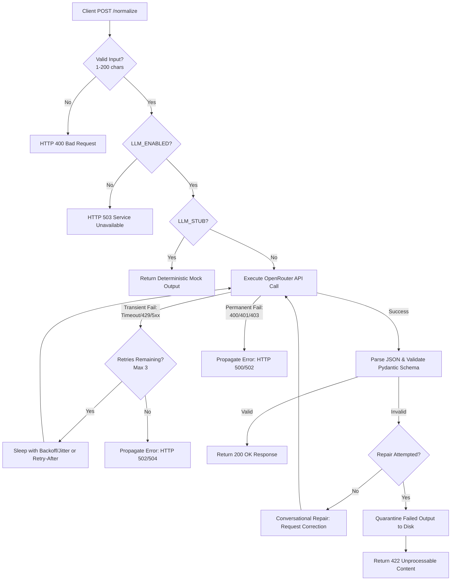

<h1 align="center">🔷 AI Job Title Normalizer API</h1>

<p align="center">
  A production-ready Python + FastAPI microservice that normalizes messy, abbreviated, or unstructured job titles into a clean, canonical software engineering role and seniority level.<br/>
  Designed defensively, treating the hosted LLM as an untrusted external dependency with explicit timeouts, transient retries, output schema validation, and conversational auto-repair.
</p>

<p align="center">
  
  
  
  
</p>

---

## 📌 Overview

The **AI Job Title Normalizer API** receives unstructured job title texts (e.g., `"Sr. SWE II"`) and uses an OpenAI-compatible hosted provider (**OpenRouter**) to map them into a structured, predictable format. 

### Core Features:
- **Input Validation**: Strictly validates that input job titles are between `1` and `200` characters, returning `HTTP 400` on validation failure.
- **Strict Output Schema**: Programmatically validates LLM JSON outputs using strict Pydantic models and enums.
- **Conversational Auto-Repair**: Performs exactly one conversational repair attempt if the initial LLM output is malformed or schema-invalid.
- **Fail-Safe Quarantine**: Logs failed transactions to a secure `quarantine/` directory for developer review, returning `HTTP 422` without leaking raw model output or system prompts.
- **Transient Retry Wrapper**: Transparently retries timeouts and HTTP `429` (respecting `Retry-After` headers) or `5xx` transient errors using bounded exponential backoff with jitter.
- **Kill Switch**: Offers a configuration toggle (`LLM_ENABLED=false`) to prevent all external AI model invocations, returning a structured `HTTP 503` service unavailable error.
- **Stub Mode**: Implements a deterministic local mock mode (`LLM_STUB=1`) to allow developers to build and test API services locally without executing real model requests.

---

## ⚙️ How It Works



| Step | Stage | Description |
|------|-------|-------------|
| 1 | **Input Parsing** | FastAPI validates that the request body matches `{"text": "string"}` and strictly verifies the string length (1-200 characters). On failure, it bypasses default handlers and returns `HTTP 400`. |
| 2 | **Inbound Guard** | Checks configurations. If `LLM_ENABLED` is false, it returns `HTTP 503`. If `LLM_STUB` is active, it returns a deterministic mock payload. |
| 3 | **Request Wrap** | Initiates an `httpx` POST to OpenRouter with an explicit 30s timeout and a payload specifying `max_tokens: 1000`. |
| 4 | **Transient Retries** | If a network error, timeout, or HTTP `429`/`5xx` is hit, the runner executes up to 3 retries (total 4 attempts) using exponential backoff with jitter. If HTTP `429` returns a `Retry-After` header, it sleeps for the specified time instead. Permanent errors (e.g. `401`, `403`) fail immediately. |
| 5 | **Schema Check** | Validates the response string against strict enums for `canonical_title` and `level`, along with confidence ranges. |
| 6 | **Auto-Repair** | If parsing or schema validation fails, the client initiates exactly **one** conversational repair attempt, showing the model its previous response and the Pydantic error details. |
| 7 | **Quarantine** | If the repair attempt fails, the client stores a full JSON debugging dump (original input, both raw responses, both error traces) to the `quarantine/` directory and returns `HTTP 422`. |

---

## 📁 Project Structure

```text
job-normalizer/
│
├── evals/
│   ├── cases.json              # 8+ labeled evaluation cases
│   └── run_evals.py            # Script executing evaluations and calculating score
│
├── prompts/
│   └── normalize-v1.md         # Versioned prompt template (role, allowed enums, rules)
│
├── src/
│   ├── routes/
│   │   └── normalize.py        # POST /normalize route definitions & exception mappings
│   ├── llm/
│   │   ├── client.py           # LLM client logic, retries, auto-repair, and stub mode
│   │   └── exceptions.py       # Custom LLM exception subclasses
│   ├── config.py               # Settings loader using pydantic-settings
│   ├── schemas.py              # Pydantic validation models and enums
│   └── main.py                 # FastAPI application instance, logging setup, and error handlers
│
├── tests/
│   └── test_normalize.py       # Pytest unit tests (Stage 1, 2, and 3)
│
├── JOB-CARD.md                 # Specifications card mapping API behavior
├── .env.example                # Example configurations file
├── .gitignore                  # Git patterns to exclude env secrets and quarantine logs
└── README.md                   # Project documentation
```

> **Note:** `.env` and the `quarantine/` directory are excluded from Git tracing by `.gitignore` to protect API keys and prevent raw unvalidated user logs from being pushed to source control.

---

## 🚀 Getting Started

### Prerequisites
Make sure Python `3.10` or higher is installed. Install the dependencies using:
```bash
pip install fastapi uvicorn pydantic pydantic-settings httpx pytest
```

### Installation Steps

#### 1. Clone the project and navigate to the directory
```bash
cd "Job Normalizer"
```

#### 2. Configure Environment Settings
Copy `.env.example` into a new `.env` file:
```bash
cp .env.example .env
```

Open `.env` and fill in your OpenRouter API Key:
```ini
LLM_ENABLED=true
LLM_STUB=1   # Set to 1 for local stub tests, 0 for real OpenRouter requests
OPENROUTER_API_KEY=sk-or-v1-your-key-here
OPENROUTER_MODEL=google/gemini-2.5-flash
OPENROUTER_TIMEOUT=30.0
```

#### 3. Run the FastAPI Application
Start the uvicorn development server:
```bash
python -m uvicorn src.main:app --port 8000 --host 127.0.0.1
```
The server will start on `http://127.0.0.1:8000`. You can inspect the interactive OpenAPI documentation at `http://127.0.0.1:8000/docs`.

---

## 🎨 Configuration Options

| Option | Type | Default | Description |
|--------|------|---------|-------------|
| `PORT` | `int` | `8000` | Port for the uvicorn server. |
| `HOST` | `str` | `127.0.0.1` | Bind address. |
| `LLM_ENABLED` | `bool` | `true` | When `false`, blocks all LLM client calls and returns `HTTP 503`. |
| `LLM_STUB` | `bool` | `true` | When `1`/`true`, returns local deterministic fake model outputs. |
| `OPENROUTER_API_KEY` | `str` | `""` | Bearer Token for OpenRouter API. |
| `OPENROUTER_MODEL` | `str` | `google/gemini-2.5-flash` | The LLM model name. |
| `OPENROUTER_TIMEOUT` | `float` | `30.0` | Connection and request timeout in seconds. |
| `LOG_LEVEL` | `str` | `INFO` | Console logger level. |

---

## 🛠️ Tech Stack

| Technology | Role |
|------------|------|
| **Python 3.13** | Core runtime language. |
| **FastAPI** | Async web routing and HTTP response lifecycle handling. |
| **Pydantic v2** | Inbound data schema parser, outbound schema enforcer, and validation checker. |
| **pydantic-settings** | Env-to-model configuration management. |
| **httpx** | Non-blocking HTTP client supporting async network operations. |
| **pytest** | Automated test runner. |

---

## 📌 API Endpoint Documentation

### POST `/normalize`
Normalizes a messy job title string.

* **Headers**: `Content-Type: application/json`
* **Request Body**:
```json
{
  "text": "Sr. SWE II"
}
```

* **Example Request (cURL)**:
```bash
curl -X POST -H "Content-Type: application/json" -d "{\"text\": \"Sr. SWE II\"}" http://127.0.0.1:8000/normalize
```

* **Example Success Response (`200 OK`)**:
```json
{
  "canonical_title": "Software Engineer",
  "level": "senior",
  "confidence": 0.98,
  "reason": "Input 'SWE' maps to Software Engineer, and 'Sr. ... II' indicates a senior level."
}
```

* **Example Input Validation Error Response (`400 Bad Request`)**:
```json
{
  "detail": "Invalid input schema.",
  "errors": [
    {
      "type": "string_too_short",
      "loc": ["body", "text"],
      "msg": "String should have at least 1 character",
      "input": ""
    }
  ]
}
```

* **Example Validation Failure Response (`422 Unprocessable Content`)**:
```json
{
  "detail": "LLM normalization failed validation after repair. Original validation error: ... Repair validation error: ..."
}
```

---

## 🧪 Running Unit Tests
A full suite of unit tests covers the validation, mock, timeout, retry, repair, and quarantine systems. Run them with:
```bash
python -m pytest -v
```

---

## 📊 Evaluation & Accuracy Score

The project includes an automated evaluation pipeline to run a set of 8 realistic test cases (including standard, abbreviation, messy, ambiguous, unsure, and non-software engineering titles) against the endpoint.

Run the evaluation suite:
```bash
python evals/run_evals.py
```

### Measured Real Accuracy Result (OpenRouter Mode)
When run against the `google/gemini-2.5-flash` model, the actual performance score is:

> **Actual Evaluation Score:** **87.50% (7/8 Cases Passed)**

```text
============================================================
           AI JOB NORMALIZER EVALUATION RUNNER
============================================================
Mode: REAL LLM MODE (OpenRouter)
Model configured: google/gemini-2.5-flash
LLM Enabled: True
============================================================
[1/8] Label: Normal/Obvious | Input: 'Backend Developer'
      Expected Title: ['Backend Engineer'] | Actual: 'Backend Engineer' (MATCH)
      Expected Level: ['mid'] | Actual: 'mid' (MATCH)
      Status: PASSED
------------------------------------------------------------
[2/8] Label: Senior Abbreviation | Input: 'Sr. SWE II'
      Expected Title: ['Software Engineer'] | Actual: 'Software Engineer' (MATCH)
      Expected Level: ['senior'] | Actual: 'senior' (MATCH)
      Status: PASSED
------------------------------------------------------------
[3/8] Label: Junior Title | Input: 'Junior Python Developer'
      Expected Title: ['Software Engineer', 'Backend Engineer'] | Actual: 'Backend Engineer' (MATCH)
      Expected Level: ['junior'] | Actual: 'junior' (MATCH)
      Status: PASSED
------------------------------------------------------------
[4/8] Label: Intern Title | Input: 'Software Engineering Intern'
      Expected Title: ['Software Engineer'] | Actual: 'Software Engineer' (MATCH)
      Expected Level: ['intern'] | Actual: 'intern' (MATCH)
      Status: PASSED
------------------------------------------------------------
[5/8] Label: Messy Title | Input: 'lead devops engineer - remote'
      Expected Title: ['DevOps Engineer'] | Actual: 'DevOps Engineer' (MATCH)
      Expected Level: ['lead'] | Actual: 'lead' (MATCH)
      Status: PASSED
------------------------------------------------------------
[6/8] Label: Ambiguous Title | Input: 'Fullstack Wizard'
      Expected Title: ['Full Stack Engineer'] | Actual: 'Full Stack Engineer' (MATCH)
      Expected Level: ['unknown', 'mid'] | Actual: 'unknown' (MATCH)
      Status: PASSED
------------------------------------------------------------
[7/8] Label: Unsure Fallback | Input: 'Chief Executive Ninja'
      Expected Title: ['Other'] | Actual: 'Other' (MATCH)
      Expected Level: ['unknown'] | Actual: 'unknown' (MATCH)
      Status: PASSED
------------------------------------------------------------
[8/8] Label: Non-Engineering Role | Input: 'Senior Product Manager'
      Expected Title: ['Other'] | Actual: 'Other' (MATCH)
      Expected Level: ['senior'] | Actual: 'unknown' (MISMATCH)
      Status: FAILED
------------------------------------------------------------
SUMMARY
  Total Cases: 8
  Passed     : 7
  Failed     : 1
  Accuracy   : 87.50%
============================================================
```
*Note: The single failure represents a non-engineering role where the model safely fell back to level "unknown" (as per the fallback policy) rather than mapping it to "senior", showing safe and predictable behavior.*

---

## 📄 License
This project is released under the [MIT License](LICENSE) — free to use, modify, and distribute.

---

<p align="center">
  Built with 🐍 Python &nbsp;·&nbsp; Standardizing career titles with confidence
</p>
